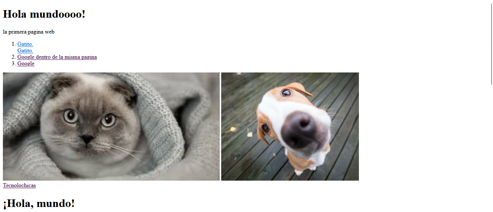
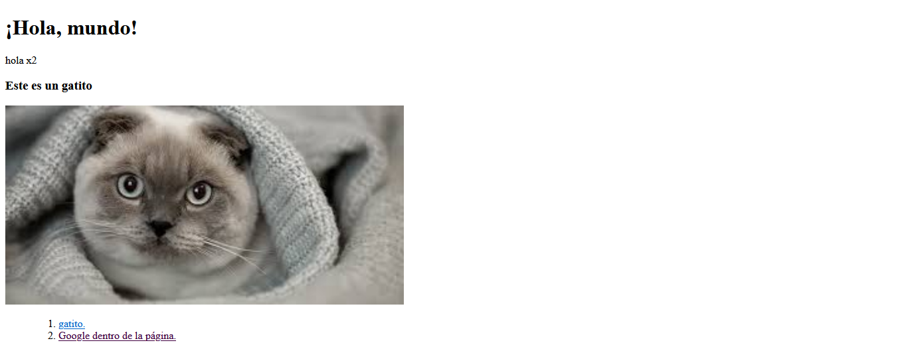
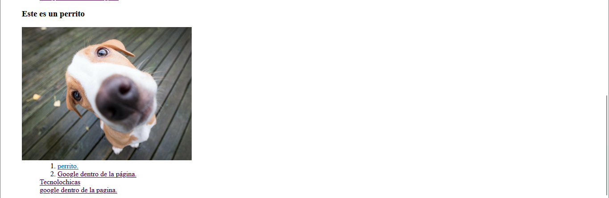

#Mi primera pagina web

##Descripción del proyecto

Primer sitio web desarrollado con HTML para el bootcam de TECNOLOCHICAS-PRO,
en el cual se lleva a cabo en el uso de etiquetas basicas y la carga de recursos 
externos (imagenes) y links de navegacion dentro y fuera del sitio 

###Link del proyecto 

[Proyecto desplegado](https://miprimerawrbeli.netlify.app/)

- Capturas de pantalla

##Tecnologia utilizada 

*HTML

###Creditos: Elizabeth Joaquin Rosales para el bootcamp de TECNOLOCHICAS-PRO

